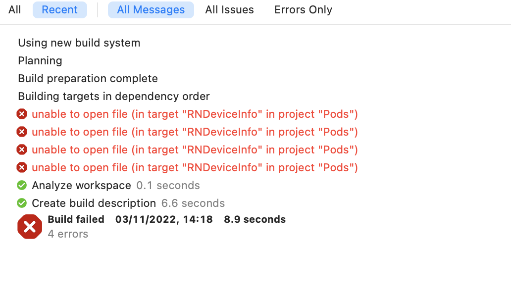
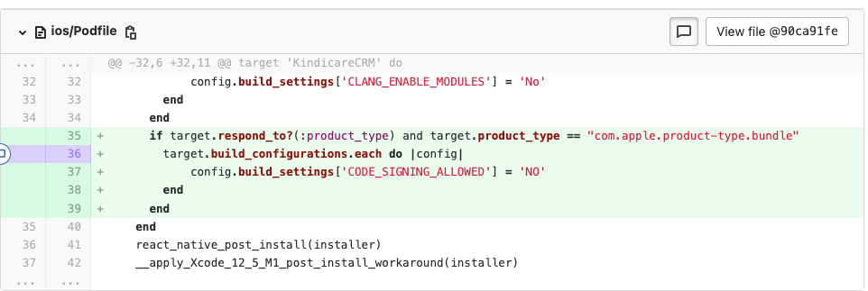

# Những lỗi hay gặp trong REACT_NATIVE

1. 
***Lỗi Build***
- `error Failed to build iOS project. We ran "xcodebuild" command but it exited with error code 65`
- `unable to open file (in target "RNDeviceInfo" in project "Pods")`

Lỗi này gặp khi build dự án, khi chuyển từ dự án này sang dự án khác
    ***Solution***

If you don't have cocoa pods installed you need to sudo gem install cocoapods

- run cd ios
- run pod install
- cd ..
- delete ios/build folder
- run npx react-native run-ios
- https://stackoverflow.com/questions/55235825/error-failed-to-build-ios-project-we-ran-xcodebuild-command-but-it-exited-wit

2. `Error: spawn ./gradlew EACCES`

- LỖi này xảy ra là khi chuyển sang dự án khắc gradlew yêu cầu truy cập. Chúng ta nhập password là ok.

**solution**
- run sudo chmod 755 android/gradlew 
- https://stackoverflow.com/questions/54541734/spawnsync-gradlew-eacces-error-when-running-react-native-project-on-emulator

3. android targetSdkVersion 30 thì update lên 31 luôn hì.

    hiện tại app nào mà android targetSdkVersion 30 thì update lên 31 luôn hì. Những chỗ cần update:
    1.  Trong file android/build.gradle, update theo
            buildToolsVersion = "31.0.0"
            compileSdkVersion = 31
            targetSdkVersion = 31
            classpath 'com.android.tools.build:gradle:7.1.1'
    2.  Trong file gradle-wrapper.properties
      distributionUrl=https\://services.gradle.org/distributions/gradle-7.2-all.zip

4. Your Ruby version is 2.3.0, but your Gemfile specified 2.2.5" while server starting
- m -rf ~/.rvm
- curl -L https://get.rvm.io | bash -s stable
- source ~/.rvm/scripts/rvm
- type rvm | head -n 1
- rvm install 2.2.5
- rvm use 2.2.5

5.  `Bug build failed when xcode 14`

- solution: 

6. Your Ruby version is 2.7.6, but your Gemfile specified 2.7.5

### solution: 
 - rvm install "ruby-2.7.5"

 - rvm use 2.7.5

link: https://github.com/facebook/react-native/issues/35127