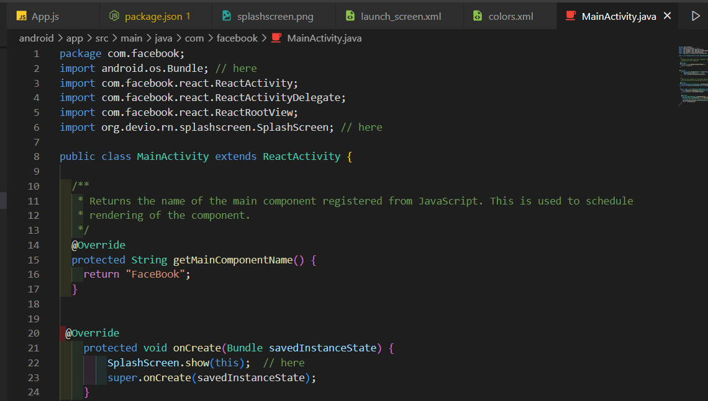

# Tạo SplashScreen cho android

Doc: https://blog.logrocket.com/building-a-splash-screen-in-react-native/

1. **npm i react-native-splash-screen --save** : Cài đặt thư viện

2. Vào **android\app\src\main\java\com\facebook** và thêm những dòng có chữ **here** vào:
   <details>

   ```ts
   package com.mysplashscreen;
   import android.os.Bundle; // here
   import com.facebook.react.ReactActivity;
   import org.devio.rn.splashscreen.SplashScreen; // here
   public class MainActivity extends ReactActivity {
   /**
    * Returns the name of the main component registered from JavaScript. This is used to schedule
    * rendering of the component.
    */
   @Override
   protected String getMainComponentName() {
       return "MySplashScreen";
   }
   // here
   @Override
       protected void onCreate(Bundle savedInstanceState) {
           SplashScreen.show(this);  // here
           super.onCreate(savedInstanceState);
       }
   }
   // here
   ```

   </details>

3. Chọn ảnh làm **SplashScreen** vào **android\app\src\main\res\drawable** dán vào đó 1 ảnh có đuôi **png**

4. Vào **app/src/main/res/layout** tạo thư mục có tên là **launch_screen.xml** và dán code này vào:

```ts
<?xml version="1.0" encoding="utf-8"?>
<RelativeLayout xmlns:android="http://schemas.android.com/apk/res/android"
    android:orientation="vertical" android:layout_width="match_parent"
    android:layout_height="match_parent">
    <ImageView android:layout_width="match_parent" android:layout_height="match_parent"
    android:src="@drawable/anh_splash"
    android:scaleType="centerCrop" />
</RelativeLayout>

```

- Chú ý đoạn code **android:src="@drawable/anh_splash"** thì **anh_splash** là tên ảnh trong thư mục **android\app\src\main\res\drawable** không có duôi **png**

5.  Vào file **App.js** của dự án để import và sử dụng **useEffect** để set thời gian tắt.
    <details>

    ```ts
    import React from "react";

    import {
      SafeAreaView,
      ScrollView,
      StatusBar,
      StyleSheet,
      Text,
      useColorScheme,
      View,
    } from "react-native";
    //Import react-native-splash-screen.
    import SplashScreen from "react-native-splash-screen";

    const App = () => {
      //Hide Splash screen on app load.
      React.useEffect(() => {
        SplashScreen.hide();
      });

      return (
        <SafeAreaView>
          <Text>Hello</Text>
        </SafeAreaView>
      );
    };

    const styles = StyleSheet.create({});

    export default App;
    ```

</details>



6. Build lại app để hoàn thành

# Đổi logo cho APP ANDROID

1. Chọn ảnh làm logo
2. Truy cập https://appicon.co/ để xuất ra nhưng file với kích cỡ khác nhau.
3. Lấy ra nhũng file cần thiết cho app, vào thêm ảnh có hình tròn vào với tên là **ic_launcher_round**


4. Vào **android\app\src\main\res** xóa những thư mục mặc định và thay vào đó là thư mục vừa tạo

5. Buil lại app để hoàn thành


# Tạo SplashScreen and Logo App cho ios 


**Link1** https://youtu.be/Ey0_kbAeWKg</br>
**Link2** https://techmaster.vn/posts/35900/tao-app-launcher-icon-cho-react-native-app-android-ios</br>
**Makeicon**: https://makeappicon.com/