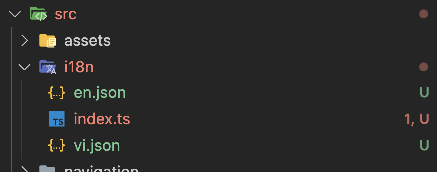

# Thêm Đa ngôn ngữ cho dự án

1. Install 2 library:
```js
yarn add i18next
yarn add react-i18next
```
2. Create folder `/src/i18n/`



3. Create `/src/i18n/index.js`
```js
import i18n from 'i18next';
import {initReactI18next} from 'react-i18next';

 const localesResource = {
   vi: {
     translation: require('./vi.json'),
   },
   en: {
     translation: require('./en.json'),
   },
 };

i18n.use(initReactI18next).init({
  compatibilityJSON: 'v3',
  resources: localesResource,
  fallbackLng: 'vi',
  // debug: true,
  interpolation: {
    escapeValue: false,
  },
  react: {
    wait: true,
  },
});

export default i18n;
```

4. Create file `en.json` and `vi.json`

```js
//en.json
{
  "home": "Home",
  "detail": "Detail",
  "go_to_detail": "Go to detail",
  "back": "Back",
  "setting": "Setting"
}
//vi.json

{
  "home": "Màn hình chính la la 2345 789",
  "detail": "Màn chi tiết",
  "go_to_detail": "Đi đến màn hình chi tiết",
  "back": "Trở lại nhe nhe he",
  "setting": "Cấu hình"
}
```

5. User in file

```js
import {StyleSheet, Text, SafeAreaView} from 'react-native';
import React from 'react';
import i18n from '../../i18n';

const Home = () => {
  const back_title = i18n.t('home');
  return (
    <SafeAreaView>
      <Text>{back_title}</Text>
    </SafeAreaView>
  );
};

export default Home;

const styles = StyleSheet.create({});


```