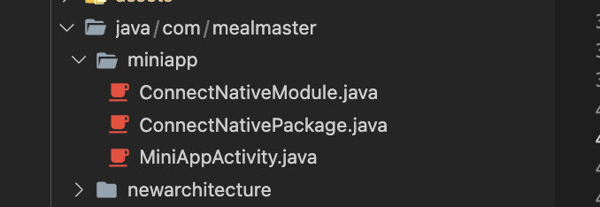

# Integrate multiple apps into one app

## GIỚI THIỆU

Xin chào tất cả mọi người. Document này sẽ giúp các bạn tích hợp nhiều app con vào một app cha trong React Native. Tôi đã áp dụng dụng thành công vào dự án của mình. Hi vọng doc này sẽ giúp các bạn !

Bời vì React Native có 2 platform là android và ios, vậy nên chúng ta cũng phải chia ra để tích hợp cho 2 platform này.


## CHUẨN BỊ


- Cần một app cha để kết nối với nhiều app con
- Download 2 file **index.android-1.bundle** , **index.ios-1.bundle**


## SET UP BÊN IOS

### Mở Xcode lên để tạo các file native sau:


1. Tạo file **Promise.h**

```h
#import <Foundation/Foundation.h>
#import <React/RCTBridgeModule.h>

@interface Promise: NSObject {
}

@property RCTPromiseRejectBlock reject;
@property RCTPromiseResolveBlock resolve;


- (instancetype)initWithResolve: (RCTPromiseResolveBlock)resolve reject: (RCTPromiseRejectBlock)reject;
@end
```

2. Tạo file **Promise.m**

```m
#import "Promise.h"

@implementation Promise

-(instancetype)initWithResolve:(RCTPromiseResolveBlock)resolve reject:(RCTPromiseRejectBlock)reject {
    self = [super init];
    self.reject = reject;
    self.resolve = resolve;
    return self;
}

@end
```

3. Tạo file **ConnectNativeModule.h**


```h
#import <React/RCTBridgeModule.h>
#import <React/RCTEventEmitter.h>
@interface ConnectNativeModule : RCTEventEmitter <RCTBridgeModule>

@end
```


4. Tạo file **ConnectNativeModule.m**

```m
#import "ConnectNativeModule.h"
#import <React/RCTRootView.h>
#import "Promise.h"
@implementation ConnectNativeModule

static NSMutableDictionary *emitters;
static NSMutableDictionary *promises;
static NSMutableDictionary *whiteList;

static UIViewController *vc;
static RCTResponseSenderBlock closeCallBack;

RCT_EXPORT_MODULE()

__attribute__((constructor))
static void initialize() {
  if (emitters == nil) emitters = [[NSMutableDictionary alloc] init];
  if (promises == nil) promises = [[NSMutableDictionary alloc] init];
}

- (NSArray<NSString *> *)supportedEvents
{
  return @[@"EventMessage", @"EventRequest"];
}

RCT_EXPORT_METHOD(openApp:(NSString *)bundleName appPath:(NSString *)appPath
                  initProps:(NSDictionary *)initProps devLoad:(BOOL)devLoad callback:(RCTResponseSenderBlock)callback)
{
    NSURL *jsCodeLocation;
    if (devLoad)
        jsCodeLocation = [NSURL URLWithString:@"http://localhost:8082/index.bundle?platform=ios&dev=true&minify=false"];
    else
        jsCodeLocation = [NSURL URLWithString:appPath];

    dispatch_async(dispatch_get_main_queue(), ^{
        RCTRootView *rootView =
          [[RCTRootView alloc] initWithBundleURL: jsCodeLocation
                                      moduleName: bundleName
                               initialProperties: initProps
                                   launchOptions: nil];
        vc = [[UIViewController alloc] init];
        [vc setModalPresentationStyle: UIModalPresentationFullScreen];
        [emitters setObject: self forKey:bundleName];
        vc.view = rootView;
        [[UIApplication sharedApplication].delegate.window.rootViewController presentViewController:vc animated:YES completion:nil];
        closeCallBack = callback;
    });
}

RCT_EXPORT_METHOD(closeApp:(NSString *)bundleName )
{
    @try {
        dispatch_async(dispatch_get_main_queue(), ^{
            [vc dismissViewControllerAnimated:YES completion:nil];
            vc = nil;
            closeCallBack = nil;
        });
        [emitters removeObjectForKey:bundleName];

    }
    @catch (NSException * e) {
        NSLog(@"Exception: %@", e);
    }
    @finally {
        NSLog(@"finally");
    }


}

RCT_EXPORT_METHOD(addBridge:(NSString *)bundleName)
{
    [emitters setObject: self forKey:bundleName];
}

RCT_EXPORT_METHOD(sendMessage:(NSString *)bundleName msg:(NSDictionary *)msg callback:(RCTResponseSenderBlock)callback)
{
    RCTEventEmitter* emitter = [emitters objectForKey: bundleName];
    NSMutableDictionary *result = [NSMutableDictionary new];
    if (emitter) {
        [emitter sendEventWithName:@"EventMessage" body:msg];
        [result setObject:@"Send message ok!" forKey:@"msg"];
    } else {
        NSString *str = @"[sendMessage] Cannot find this bundle name ";
        str = [str stringByAppendingString:bundleName];
        [result setObject:str forKey:@"msg"];
    }
    callback(@[result]);
}

RCT_EXPORT_METHOD(replyResponse:(NSString *)requestId response: (NSDictionary *)response callback:(RCTResponseSenderBlock)callback)
{
    Promise *promise = [promises objectForKey:requestId];
    NSMutableDictionary *result = [NSMutableDictionary new];
    if (promise) {
        promise.resolve(response);
        [promises removeObjectForKey:requestId];
        [result setObject:@"Reply response ok!" forKey:@"msg"];
    } else {
        NSString *str = @"[replyResponse] Cannot find promise with id ";
        str = [str stringByAppendingString:requestId];
        [result setObject:str forKey:@"msg"];
    }
    callback(@[result]);
}

RCT_REMAP_METHOD(getBundleNames,
                 resolver:(RCTPromiseResolveBlock)resolve
                 rejecter:(RCTPromiseRejectBlock)reject)
{
    NSArray *arr = [emitters allKeys];
    if (arr.count > 0) {
        resolve(arr);
    } else {
        NSError *nsError = [NSError errorWithDomain:@"Error " code:0 userInfo:nil];
        reject(@"Error", @"No listeners", nsError);
    }
}

@end
```

###  Add file index.ios-1.bundle vào XCode


## SET UP BÊN ANDROID


### Tạo thư mục assets sau đó bỏ index.android-1.bundle bundle id vào

```
android/app/src/main/assets/index.android-1.bundle
```

### Tạo module native

Trong folder **android/app/src/main/java/com/superapp**


1. Tạo folder **miniapp**  gồm 2 file native **ConnectNativeModule.java**, **ConnectNativePackage.java** để xử lý mở app con, và 1 file **MiniAppActivity.java** để xử lý những hoạt động của Android.




2. Trên file **AndroidManifest.xml** thêm **MiniAppActivity** vào

```xml
<activity
            android:name=".miniapp.MiniAppActivity"
            android:windowSoftInputMode="adjustResize"
            android:configChanges="keyboard|keyboardHidden|orientation|screenLayout|screenSize|smallestScreenSize|uiMode"
            android:exported="false" />
```

3. File **ConnectNativePackage.java**

```java
package com.mealmaster.miniapp;  change with your app

import com.facebook.react.ReactPackage;
import com.facebook.react.bridge.JavaScriptModule;
import com.facebook.react.bridge.NativeModule;
import com.facebook.react.bridge.ReactApplicationContext;
import com.facebook.react.uimanager.ViewManager;

import java.util.Arrays;
import java.util.Collections;
import java.util.List;

public class ConnectNativePackage implements ReactPackage {

    @Override
    public List<NativeModule> createNativeModules(ReactApplicationContext reactContext) {
        return Arrays.<NativeModule>asList(new ConnectNativeModule(reactContext));
    }

    public List<Class<? extends JavaScriptModule>> createJSModules() {
        return Collections.emptyList();
    }

    @Override
    public List<ViewManager> createViewManagers(ReactApplicationContext reactContext) {
        return Collections.emptyList();
    }
}

```

4. File **ConnectNativeModule.java**

```java
package com.mealmaster.miniapp; change with your app

import android.content.Intent;
import android.os.Bundle;

import androidx.annotation.Nullable;

import com.facebook.react.bridge.Arguments;
import com.facebook.react.bridge.Callback;
import com.facebook.react.bridge.Promise;
import com.facebook.react.bridge.ReactApplicationContext;
import com.facebook.react.bridge.ReactContext;
import com.facebook.react.bridge.ReactContextBaseJavaModule;
import com.facebook.react.bridge.ReactMethod;
import com.facebook.react.bridge.ReadableMap;
import com.facebook.react.bridge.WritableArray;
import com.facebook.react.bridge.WritableMap;
import com.facebook.react.modules.core.DeviceEventManagerModule;
import java.util.HashMap;
import java.util.Map;
import java.util.Objects;

public class ConnectNativeModule extends ReactContextBaseJavaModule {
    private ReactApplicationContext reactContext;
    private static final Map<String, ReactContext> _reactContexts = new HashMap<>();
    private static Callback _closeCallback = null;


    public ConnectNativeModule(ReactApplicationContext reactContext) {
        super(reactContext);
        this.reactContext = reactContext;
    }


    @ReactMethod
    public void openApp(String bundleName, String appPath, ReadableMap initProps,
                        boolean devLoad, Callback callback) {
        Intent intent = new Intent(reactContext, MiniAppActivity.class);
        intent.setFlags(Intent.FLAG_ACTIVITY_NEW_TASK);
        Bundle bundle = new Bundle();
        bundle.putString("bundleName", bundleName);
        bundle.putString("appPath", appPath);
        bundle.putBoolean("devLoad", devLoad);
        bundle.putBundle("initProps", Arguments.toBundle(initProps));
        intent.putExtras(bundle);
        reactContext.startActivity(intent);
        addBridge(bundleName);
        _closeCallback = callback;
    }

    @ReactMethod
    public void sendMessage(String bundleName, ReadableMap msg, Callback callback) {
        ReactContext reactContext = _reactContexts.get(bundleName);
        WritableMap result = Arguments.createMap();
        if (reactContext != null) {
            WritableMap map = Arguments.createMap();
            map.merge(msg);
            pushEvent(reactContext, "EventMessage", map);
            result.putString("msg", "Send message ok!");
        } else {
            result.putString("msg", "Cannot find this bundle name " + bundleName);
        }
        callback.invoke(result);
    }


    @ReactMethod
    public void addBridge(String bundleName) {
        _reactContexts.put(bundleName, reactContext);
    }


    @ReactMethod
    public void closeApp(String bundleName) {
        if(_closeCallback == null) {
            return;
        }
        MiniAppActivity.close();
        _closeCallback = null;
        _reactContexts.remove(bundleName);
    }

    @ReactMethod
    public void getBundleNames(Promise promise) {
        if (_reactContexts.keySet().toArray() != null) {
            String[] bundleNames = Objects.requireNonNull(_reactContexts.keySet().toArray(new String[0]));
            WritableArray arrays = Arguments.fromArray(bundleNames);
            promise.resolve(arrays);
        } else {
            promise.reject(new Throwable("No listeners"));
        }
    }

    private void pushEvent(ReactContext reactContext, String eventName, @Nullable WritableMap params) {
        reactContext
                .getJSModule(DeviceEventManagerModule.RCTDeviceEventEmitter.class)
                .emit(eventName, params);
    }

    public String getName() {
    return "ConnectNativeModule";
    }
}

```

5. File **MiniAppActivity.java**

```js

package com.mealmaster.miniapp;   changewith your app

import android.os.Bundle;

import com.facebook.hermes.reactexecutor.HermesExecutorFactory;
import com.facebook.react.ReactActivity;
import com.facebook.react.ReactInstanceManager;
import com.facebook.react.ReactPackage;
import com.facebook.react.ReactRootView;
import com.facebook.react.common.LifecycleState;
import com.facebook.react.modules.core.DefaultHardwareBackBtnHandler;
import com.facebook.react.shell.MainReactPackage;
import com.rnmaps.maps.MapsPackage;
import com.mealmaster.MainActivity;

import java.util.ArrayList;
import java.util.Arrays;
import java.util.List;

public class MiniAppActivity extends ReactActivity implements DefaultHardwareBackBtnHandler {
    private static MiniAppActivity mInstance;
    private String mMainComponentName;
    private static ReactInstanceManager mReactInstanceManager;

    @Override
    protected void onCreate(Bundle savedInstanceState) {
        super.onCreate(savedInstanceState);
        mInstance = this;
        Bundle bundle = getIntent().getExtras();
        assert bundle != null;
        mMainComponentName = bundle.getString("bundleName", "");
        boolean devLoad = bundle.getBoolean("devLoad");
        Bundle initProps = bundle.getBundle("initProps");

        ReactRootView mReactRootView = new ReactRootView(this);

//        val packages: List<ReactPackage> = PackageList(application).packages
            String appPath = bundle.getString("appPath", "");
            mReactInstanceManager = ReactInstanceManager.builder()
                    .setApplication(getApplication())
                    .setJavaScriptExecutorFactory(new HermesExecutorFactory())
                    .setCurrentActivity(this)
                    .setBundleAssetName(appPath)
                    .setJSMainModulePath("index")
                    .addPackages(getPackages())
                    .setUseDeveloperSupport(devLoad)
                    .setInitialLifecycleState(LifecycleState.RESUMED)
                    .build();
        mReactRootView.startReactApplication(mReactInstanceManager, mMainComponentName, initProps);
        setContentView(mReactRootView);
    }


    public ArrayList<ReactPackage> getPackages() {
        return new ArrayList<>(Arrays.<ReactPackage>asList(
                new MainReactPackage(), // sync native
                new ConnectNativePackage(), // sync native
                new MapsPackage() // sync native

        ));
    }

    @Override
    protected String getMainComponentName() {
        return mMainComponentName;
    }

    public static void close() {
        if (mInstance != null) mInstance.finish();
        mInstance = null;
    }
    @Override
    public void invokeDefaultOnBackPressed() {
        super.onBackPressed();
    }
    @Override
    public void onBackPressed() {
        if (mReactInstanceManager != null) {
            mReactInstanceManager.onBackPressed();
        } else {
            super.onBackPressed();
        }
    }
}
```


6. Thêm packages vào **MainApplication.java**

```java
.....

    @Override
        protected List<ReactPackage> getPackages() {
          @SuppressWarnings("UnnecessaryLocalVariable")
          List<ReactPackage> packages = new PackageList(this).getPackages();
          // Packages that cannot be autolinked yet can be added manually here, for example:
          packages.add(new ConnectNativePackage()); // thêm đây
          return packages;
        }

        @Override
        protected String getJSMainModuleName() {
          return "index";
        }
      };


      .....


```


## Lưu ý:

1. Mỗi lẫn change ở app con thì phải generate bundle lại:

- ios:
```
 npx react-native bundle --platform ios --dev false --entry-file index.js --bundle-output ../../ios/index.ios-1.bundle --assets-dest ../../ios/ --reset-cache
```

- android:

```
npx react-native bundle --platform android --dev false --entry-file index.js --bundle-output ../../android/app/src/main/assets/index.android-1.bundle --assets-dest ../../android/app/src/main/res/
```

2. Các thư viện ở app con phải đươc cài sẵn ở app cha

